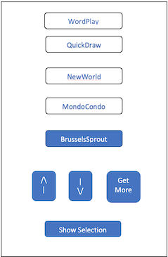

# Exercise1

## Implement an MVP Stack

Please implement this assignment using an MVP (UseCase /View/Presenter) stack, using the repository from the startup_namer_clean demo.

Use a Cubit for both the Presenter and the UseCase.

## The View

Create a user interface that looks like this:

 

## The Behaviour
### The Up Button
- Is disabled when the first word in the backing list is at the top of the display and enabled otherwise.
- does not change the selected word
- moves the words in the list down by one word.
### The Down Button
- is disabled when the last word in the backing list is at the bottom of the display and enabled otherwise.
- does not change the selected word
- moves the words in the list up by one word.
### The Get More Button
- is enabled when the last word in the backing list is at the bottom of the display and disabled otherwise.
- does not change the selected word
- enables the Down button
- disables the Get More button
### The Word buttons 
- are all deselected until one is selected
- selection of one word
	- deselects any other word button
	- enables the Show Selection button
### The Show Selection Button
- displays an alert with the selected word.
- Is only enabled when a word is selected
